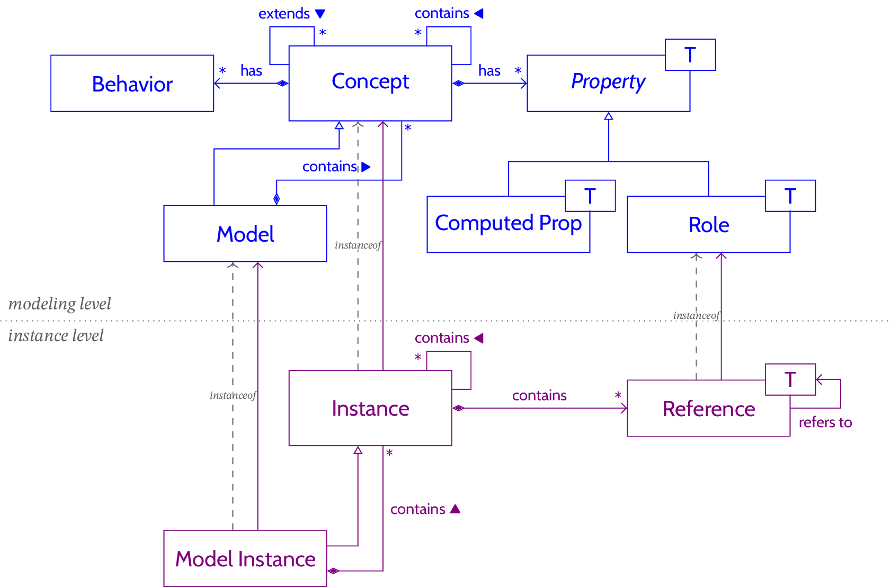
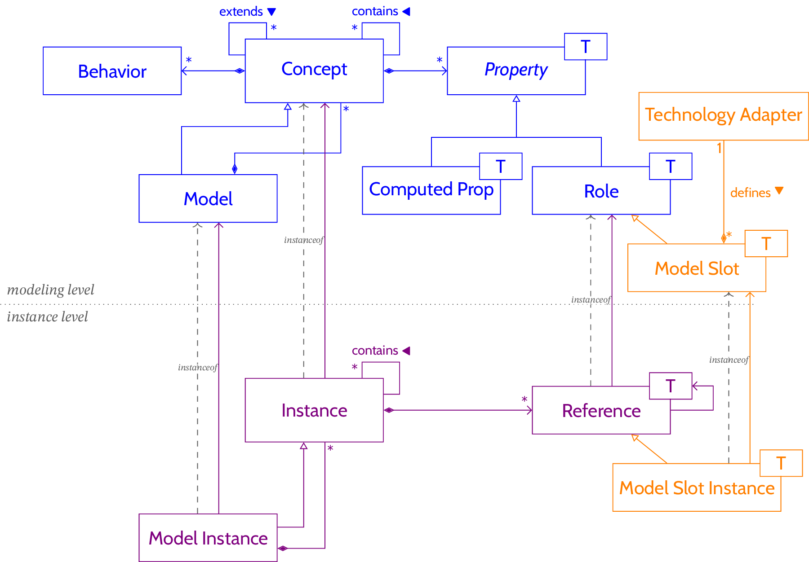

% A tutorial for building technology adapters
% Fabien Dagnat

# Context

Openflexo is a framework supporting model federation and free
modeling. It relies on a modeling language named FML whose central
notion is the *concept* (`FlexoConcept` in the code). Each concept has
properties and an executable behavior specifying how to manipulate its
instances (`FlexoConceptInstance` in the code). The properties can
link together instances. Intuitively, FML provides a class and object
paradigm. FML also comes with a language to build expressions named
*binding* computing values reusing data from other instances. This
basic description of the core of FML is represented below using a UML
like diagram.

At runtime, both the modelling level and the instance level exist and
are linked. Manipulating model instances and their concept instances
is done using the behaviors of the modelling level. An instance
maintains references toward data and also offer access to value
computed at each access through the *computed properties* of its
concept.

The core of Openflexo is an FML interpretor. Tools built using
Openflexo consists of FML models.

Openflexo core is also built to link FML models to external source of
data named *resources*. Such resources are accessed by the FML
interpretor through *connectors* (`ModelSlot` in the code). Such a
connector is in charge of maintaining the link between the running FML
models and the resource. The implementation of a connector is offered
by a library called *Technology Adapter* (named TA after). This add
the orange part in the following diagram.

The purpose of this tutorial is to give an insight of how to develop a
TA.

# Conceptual view

A TA provides the definition of:

  1) the abstractions representing the various elements of the
external data, called here after, the *TA concepts*

  2) the *actions* to manipulates these TA concepts instances from
  model federation behaviors

  3) a set of *model slot types* defining the way virtual model
  instances will be connected to the data

# Implementation view

A TA is composed of a set of Java classes. It serves several
objectives and therefore is structured as a set of Java packages. It
is generally defined using annotations from FML and Pamela
(annotations for serialization / deserialization).

Let us suppose the TA is for the technology space xx.

## Overview

You should structure it around the following packages:

1) `xx` containing

    1) The declaring class `XXTechnologyAdapter` defining the TA. It declares the available model slots, custom types and factories.

    2) The various model slots, the `YyXXModelSlot` interfaces declaring the accessible TA concepts and the actions to manipulate them.

2) `xx.model` containing the abstractions of the underlying
technology, called *technology objects*, and the factory to
instanciate them.

3) `xx.rm` containing the classes that implements the resource
management: resource definition, serialization / deserialization,
identification...

4) `xx.fml` containing the definition of the TA concepts and their actions relying on `xx.model` and `xx.rm`.

## Details

### The declaring class `XXTechnologyAdapter`

First you must declare your TA by extending the `TechnologyAdapter`
class with the generic parameter `XXTechnologyAdapter`.

This class must declare the various model slots types, specific
custom types and resource factories using FML annotations. A model
slot type is declared using the annotation
`@@DeclareModelSlots({YyXXModelSlot.class,ZzXXModelSlot.class})`,
`@@DeclareTechnologySpecificTypes({...})` is for specific types while
resource factories are declared by
`@@DeclareResourceFactories({...})`.

Being a TA requires to define:

* the name of the TA, method `String getName()`{.java}
* an identifier for the FML language, method `String getIdentifier()`{.java}
* the path to the localization resources (a.k.a dictionnaries) , method `String getLocalizationDirectory()`{.java}, it is often `"FlexoLocalization/XXTechnologyAdapter"`
* specify which resources should be ignored when presenting all available resources, method `<I> boolean isIgnorable(FlexoResourceCenter<I> resourceCenter, I contents)`, it often returns `false`
* specify the *binding factory* for the specific types of the TA, this factory is a singleton often defined as a private final static attribute of the TA, method `TechnologyAdapterBindingFactory getTechnologyAdapterBindingFactory()`

### Model slots

There is two kinds of model slots: the free ones extending
`FreeModelSlot` and the type aware ones extending
`TypeAwareModelSlot`. The former may point to any resource while the
latter must point to a typed resource. Therefore, defining a type
aware model slot require that you specify the type of the resource
accessed. This type is generally a metamodel describing the language
in which the model is described. For example, the EMF TA provides a
type aware model slot that enable to connect to a model conforming to
a specified metamodel. Type aware model slot are more complex but are
more powerful because they know the precise form of the models they
will be connected to.

For this basic tutorial, we will only look at the free model slot and
invite the reader interested in type aware ones to look at the code of
the OWL TA.

In the model slot, you should declare four lists:

* the list of roles `@@DeclareFlexoRoles({...})` specific to your technology
<!---
XXLineRole.class
-->
* the list of actor reference `@@DeclareActorReferences({...})`
<!---
XXLineActorReference.class
-->
* the list of actions `@@DeclareEditionActions({...})`
<!---
AddXXLine.class
-->
* the list of requests `@@DeclareFetchRequests({...})`
<!---
SelectUniqueXXLine.class, SelectXXLine.class
-->

A model slot is defined using the pamela framework as an interface.
This interface may contain pamela attributes to store properties
specific to the model slot and must contain its implementation as an
internal class. This implementation must extends either the class
`FreeModelSlot`, the class `TypeAwareModelSlot` or any classes that
specialize them.

A model slot is parameterized by the technology object it provides
access to.

public interface XXModelSlot extends FreeModelSlot<XXText> {

	public static abstract class XXModelSlotImpl extends FreeModelSlotImpl<XXText> implements XXModelSlot {

		@SuppressWarnings("unused")
		private static final Logger logger = Logger.getLogger(XXModelSlot.class.getPackage().getName());

		@Override
		public Class<XXTechnologyAdapter> getTechnologyAdapterClass() {
			return XXTechnologyAdapter.class;
		}

		@Override
		public <PR extends FlexoRole<?>> String defaultFlexoRoleName(Class<PR> patternRoleClass) {
			if (XXLineRole.class.isAssignableFrom(patternRoleClass)) {
				return "line";
			}
			return null;
		}

		@Override
		public Type getType() {
			return XXText.class;
		}

		@Override
		public XXTechnologyAdapter getModelSlotTechnologyAdapter() {
			return (XXTechnologyAdapter) super.getModelSlotTechnologyAdapter();
		}

## A complete example

## Advanced usage

Looking at the available TA helps to discover the various extensions
you may need for more complex TA.

Context manager `XXTechnologyContextManager` extending
`TechnologyContextManager<XXTechnologyAdapter>` can be defined to
manage a context related to a technology. It stores the known
resources of this technology. For example, [(Sylvain, which example?)]{.todo}...

